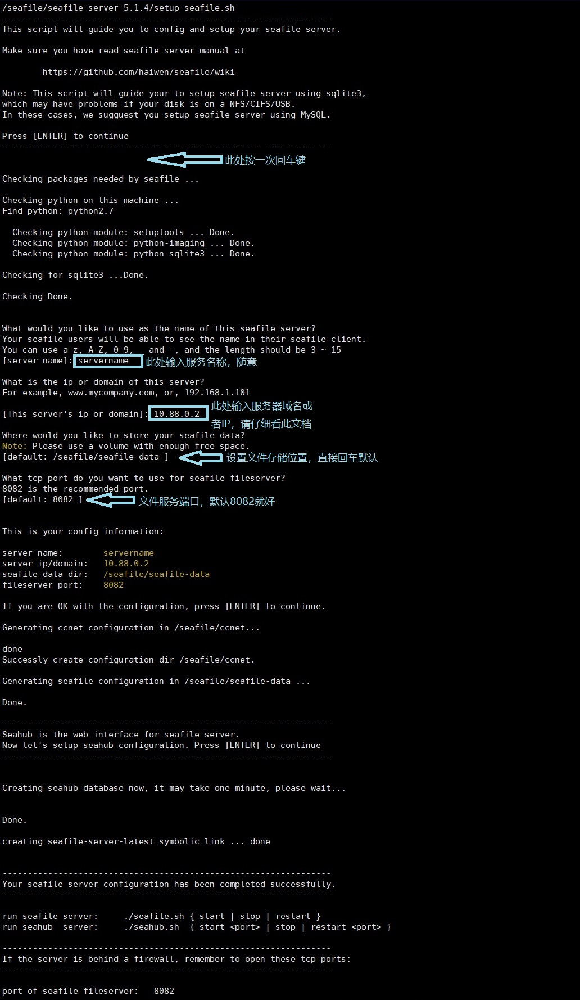
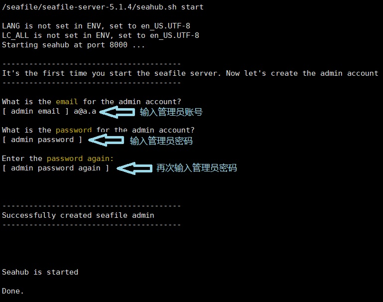
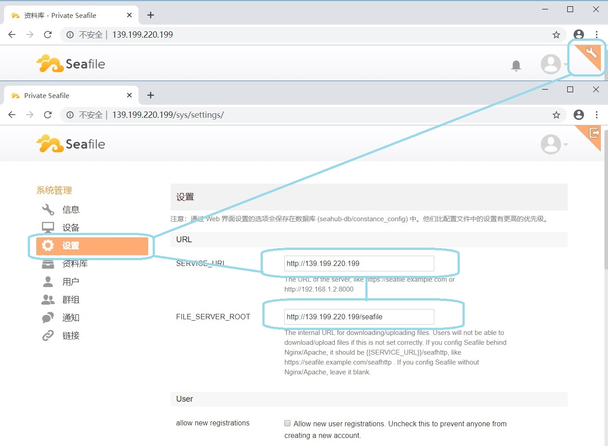

# Centos7 安装 Seafile5.1.4
> 参考：https://cloud.seafile.com/published/seafile-manual-cn/home.md
* Seafile5.1.4比较使用，占用内存较小
* 不建议使用web界面上传大文件，会有卡顿问题，导致上传失败
* 非web端会把文件分成1m小块上传，支持断点续传
* web集成的markdown还是不错的，可以直接当私人博客用
* 别使用迅雷或者360浏览器下载文件，迅雷引擎token有问题
## 在实体机上安装Seafile5.1.4
```shell
yum install -y wget which python-setuptools python-pillow
mkdir /seafile
cd /seafile/
wget https://mc.qcloudimg.com/static/archive/3d8addbe52be88df4f6139ec7e35b453/seafile-server_5.1.4_x86-64.tar.gz
tar -zxvf seafile-server_5.1.4_x86-64.tar.gz
/seafile/seafile-server-5.1.4/setup-seafile.sh
```

```shell
/seafile/seafile-server-5.1.4/seafile.sh start
/seafile/seafile-server-5.1.4/seahub.sh start 8000
```

* 需要在防火墙打开8000和8082端口
------------------------------------------------------------------------------
------------------------------------------------------------------------------
## podman/docker版本(附加nginx跳转)
* seahub为web服务，默认端口是8000
* seafile是文件服务器，负责upload和downlod文件，端口8082
* 在seahub和seafile是分开的服务，要注意客户端访问的IP和端口
### 安装必备插件
```shell
yum install -y wget which python-setuptools python-pillow
```
* wget下载软件用
* which在setup-seafile.sh用来判断python版本
* python-setuptools提供setuptools
* python-pillow提供python-imaging

### 下载解压seafile
```shell
mkdir /seafile
cd /seafile/
wget https://mc.qcloudimg.com/static/archive/3d8addbe52be88df4f6139ec7e35b453/seafile-server_5.1.4_x86-64.tar.gz
tar -zxvf seafile-server_5.1.4_x86-64.tar.gz 
```

### 配置
```shell
/seafile/seafile-server-5.1.4/setup-seafile.sh
```


### 开启服务
```shell
/seafile/seafile-server-5.1.4/seafile.sh start
/seafile/seafile-server-5.1.4/seahub.sh start
```

* 设置管理员账号为：a@a.a	(必须是邮箱，是不是真的无所谓)
* 设置管理员密码为：aaaaaa	(6个a)

## 使用nginx跳转配置
在http.server下修改为以下内容，重启
```txt
location / {
    proxy_pass http://10.88.0.2:8000/;
}
location /seafile/ {
    rewrite ^/seafile(.*)$ $1 break;
    client_max_body_size 0;
    proxy_pass http://10.88.0.2:8082/;
}
```
> 因seafile原端口为8082，跳转后路径变化，故rewrite重写路径

> 因nginx跳转原理，文件缓存默认为1m，大文件直接丢弃，
> 故client_max_body_size设置为0，取消限制
* 修改后需要根据客户端访问服务器的ip做修改

